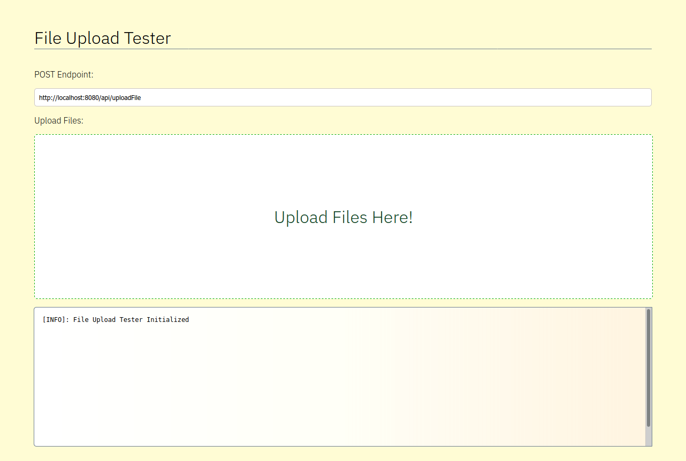

# File Uploading Demo

A demo Spring application that allows a client to upload files and writes them to a specified directory.

Running The Demo:
1) Modify the `application.properties` file to define the directory where uploaded files should be written.
2) Start the Spring application, ex. `mvn spring-boot:run`
3) In your browser, open `http://localhost:8080` or whatever address the server is configured to run on.
4) Drag files into the upload area to automatically upload them to the server. If you customized the server port then change the `POST Endpoint` in the interface accordingly.



# Important Note
By default, Spring restricts the file upload size to about 1MB.
To change this, you can modify these settings in your `application.properties` and set a new maximum.
For example, to increase the max to 512MB you can add:
```properties
spring.servlet.multipart.max-file-size = 512MB
spring.servlet.multipart.max-request-size = 512MB
```